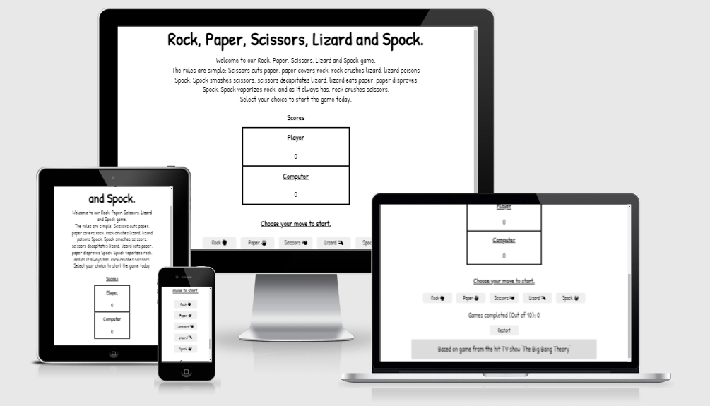
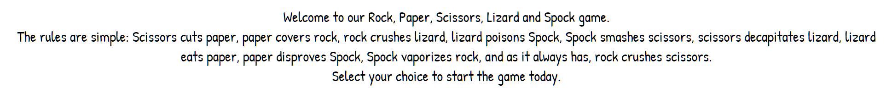
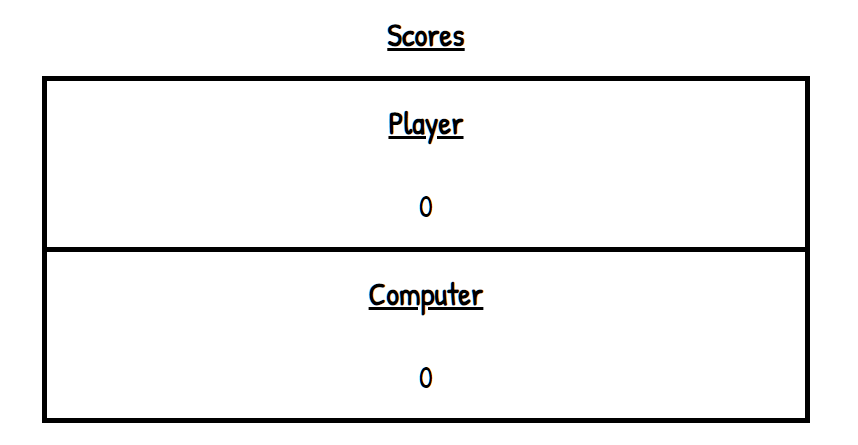
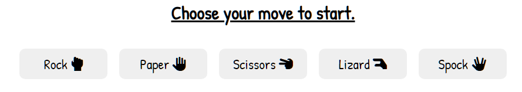
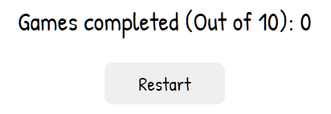
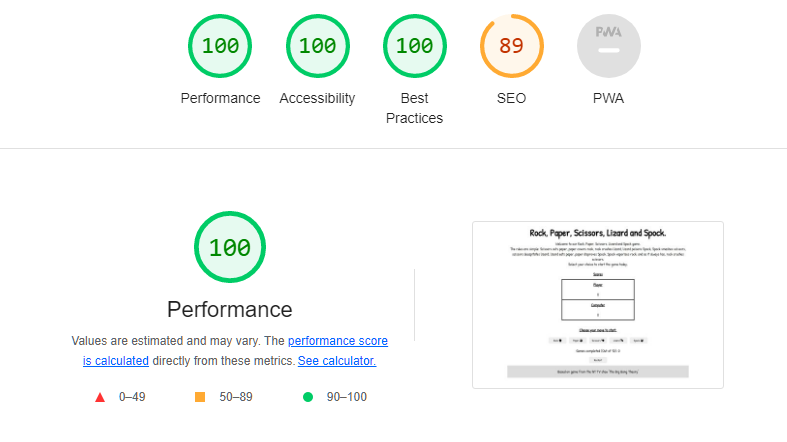

# Rock, Paper, Scissors, Lizard and Spock

## Overview.

The Rock, Paper, Scissors, Lizard and Spock game website is a simple yet random game controlled with a Javascript backend. The Javascript backend allows for a complete random selection by the computer and allows a fair one vs one game.

The layout is easy to use with clear white, black and grey color system to ensure readability by all those who use it. The base responsiveness of the CSS code allows for the website to be viewed on all devices without the need for specific media quireies.

## Features

The main aim of this website was to demonstrate how pure Javascript works and can be used for a real world game. Targeted towards people who both like the hit TV show 'The Big Bang Theory', this site allows for a quick yet classic game.

### Existing features

- **Logo and screen title**

    * Featured at the top of the page. This responsive text shows clearly what the website is used for in large letters showing the title.

- **Instructions**

    * Although the simple and classic nature of the game an instructions section is important to include the rules about who can win and why.
    * Written using a readable but fun font which is used for all of the information on the site.
    

- **Scores**

    * A key part of any game is keeping score. This section updates with the winners score on each round in each own box.
    * The Javascript backend allows for automatic updating of the scores to ensure fairness.

- **Player options**

    * To play the player has to select an option of any one of the options. Each button option has its own icon explaining.
    * Each button has been given a unique identifer which is used by the Javascript to ensure the right outcomes.

- **Games completed and restart button**

    * Built into the javascript their is a limit on amount of games played in each round. 
    * The Javascript allows the game counter the automatically increase with each game played while the restart button resets the stats.

- **Credit Footer**

    * Right at the bottom of the page is the footer. To match the flow of the page I have placed in center with the rest of the content.
    * This is also an opportunity to give credit to any inspiration.

### Features left to Implement

- A good feature idea would be to add social media share links into the footer or within the scores area to allow people to share their games.

## Testing

### Initial testing

During website creation much testing was needed to ensure complete workflow within the Javascript backend. 

- The main one of such was the implimentation of eventListeners after the page loads. Testing was needed so the correct feedback was generated onto the next stage of the backend.

- The next main issue which was the focus of testing was to ensure the random generation of a number which can be linked with an outcome for the computers choice. Ensuring console.log() to ensure the selection was random.

- The last focus of my testing during development was to ensure both the score and results was updated onto the site at the end of each game. This would allow complete loop of the game system for users to play again.

After development my testing included users on multiple devices to find any bugs not yet found during devlopment and that the outcome of each and every game was the same and correct.

### Validator Testing

- HTML
    * No errors were returned when passing through the official [W3c validator](https://validator.w3.org/nu/?doc=https%3A%2F%2Fjoshsandhu.github.io%2FProject_2%2F)
- CSS
    * No errors were returned when passing through the official [(Jigsaw) Validator](https://jigsaw.w3.org/css-validator/validator?uri=https%3A%2F%2Fjoshsandhu.github.io%2FProject_2%2F&profile=css3svg&usermedium=all&warning=1&vextwarning=&lang=en)
- JavaScript
    * A couple of warnings however no errors were found when passing through the official [Jshint validator](https://jshint.com/)
        - The following metrics were returned:
            * There are 8 functions in this file.
            * Function with the largest signature take 1 arguments, while the median is 0.5.
            * Largest function has 27 statements in it, while the median is 4.5.
            * The most complex function has a cyclomatic complexity value of 18 while the median is 1.5.
- Accessibility
    * I confirmed with Lighthouse in devtools that the website is easy to read and accessible.

## Deployment

The live link for this website can be found [here](https://joshsandhu.github.io/Project_2/)

- The site was deployed to GitHub pages. The steps are as follows:
    * In GitHub repository, navigate to the Settings tab.
    * From there go down to Pages in the left column.
    * On the source selection drop-down box select the Master Branch.
    * Once this has been selected you are given a link after a page refresh.

## Credits

I would like to take this space to say thank you to the people who gave me the idea for this webpage and game. I would also like to thank the specific programmers who I have used code and ideas within the webpage.

### Content

- The base JavaScript code including the eventListeners was used from the Code Institute lessons.
